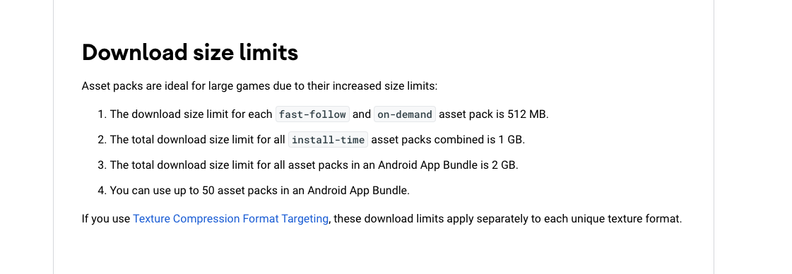
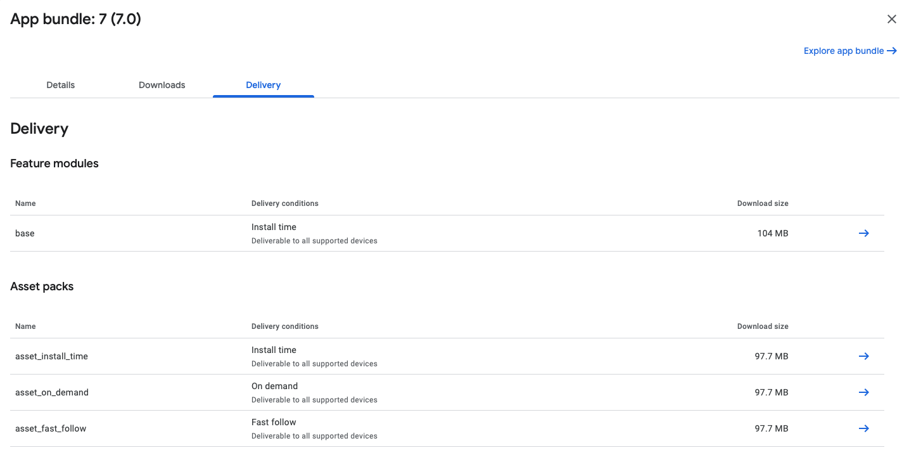
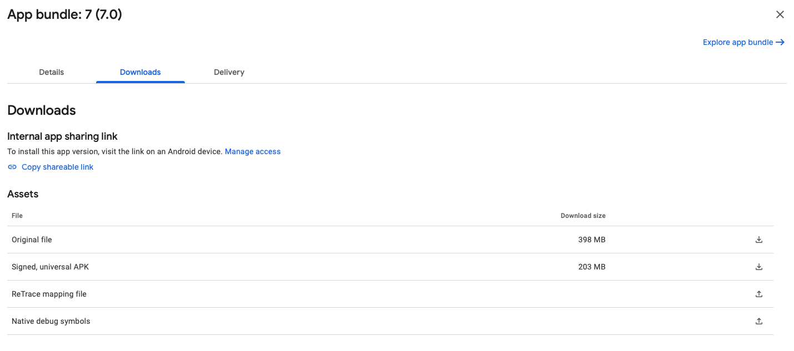
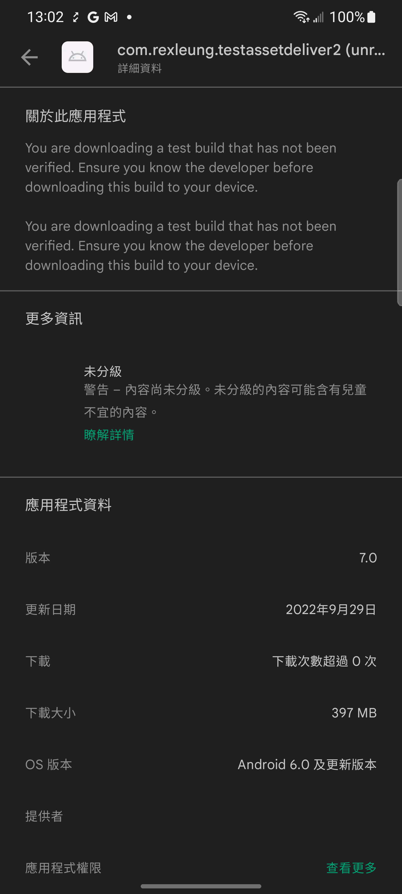
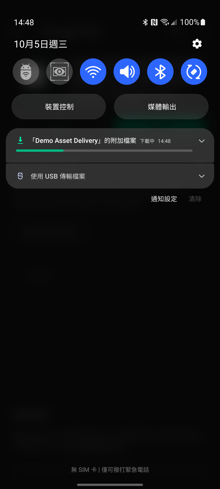
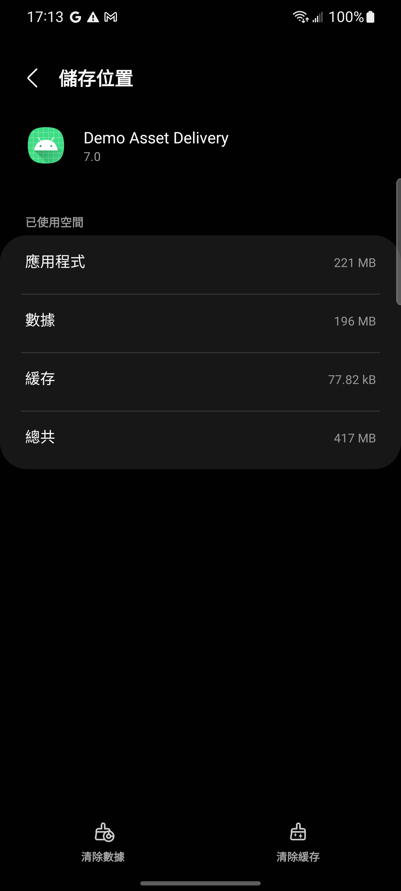
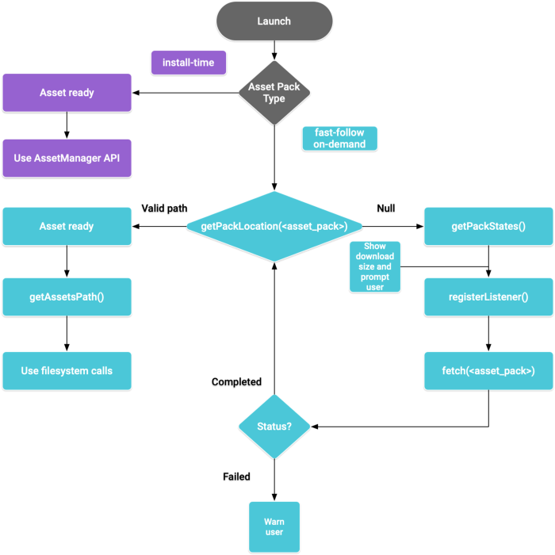

# android-asset-delivery-demo
Create one (Android/ Kotlin) demo for Asset Delivery from Google Play

### Same Video


|      Project ShortCut       | Description |
| ------------- | ------------- |
| [Video - Local Asset](https://gitlab.com/developer378/demo/asset-delivery-demo-android/-/tree/main/app/src/main/assets) | 1. Placed in root project <br/> 2. Counted in <b>APP</b> size |
| [Video - Install Time](https://gitlab.com/developer378/demo/asset-delivery-demo-android/-/tree/main/asset_fast_follow) | 1. Placed in module project <br/> 2. Allow to open App until <b>[downloaded complete]</b> <br/>3. Size limit is <b>1 GB</b> |
| [Video - Fast Follow](https://gitlab.com/developer378/demo/asset-delivery-demo-android/-/tree/main/asset_install_time) | 1. Placed in module project <br/> 2. Allow to open App when <b>[downloading asset]</b> <br/> 3. Request to download when app is running <br/> 4. Size limit is <b>512 MB</b> |
| [Video - On Demand](https://gitlab.com/developer378/demo/asset-delivery-demo-android/-/tree/main/asset_on_demand) | 1. Placed in module project <br/> 2. Request to download when app is running <br/> 3. Size limit is <b>512 MB</b> |


```
assetPack {
    packName = ""   // Package Name
    dynamicDelivery {
        deliveryType = ""    // install-time / fast-follow / on-demand
    }
}
```

- if Delivery Type is `install-time`, `packName` is not valid and placed file on `asset://`
- Other Delivery Type placed file on `asset://$packName`



# Google Console - App Detail



# Install Time


## base `104MB`  install time `97.7MB`


# Fast Follow
## Fast Follow `97.7MB`


# On Demand
## On Demand `97.7MB`


# Download - Fast Follow && On Demand
- When downloading asset, will show in notication bar and allow to cancel the asset.
- if clear data, will clear asset file of Fast Follow and On Demand.





# Google Document


# Reference
[Play Asset Delivery](https://developer.android.com/guide/playcore/asset-delivery)

[Integrate asset delivery (Kotlin & Java) ](https://developer.android.com/guide/playcore/asset-delivery/integrate-java#groovy)

